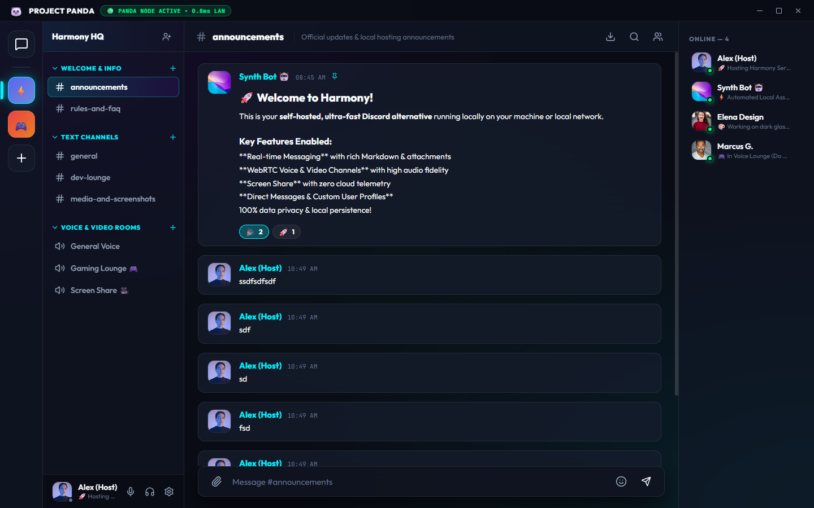

# 🐼 Project Panda — Futuristic Windows Local Communication App

**Project Panda** is a next-generation Windows desktop application for self-hosted local communication, featuring a unique **Holographic Glassmorphic Sci-Fi Design System**, real-time text chat, high-fidelity WebRTC voice/video mesh, screen sharing, sci-fi theme customization, hardware device routing, and local persistent data storage with zero third-party telemetry.



- **GitHub Repository**: [https://github.com/dima20012/project-panda](https://github.com/dima20012/project-panda)
- **Latest Windows Release (v1.2.0)**: [https://github.com/dima20012/project-panda/releases/tag/v1.2.0](https://github.com/dima20012/project-panda/releases/tag/v1.2.0)

---

## 🌟 Feature Highlights

- 🎙️ **Audio & Video Device Routing**: Select custom microphones, output speakers/headsets, and cameras. Features a live camera test preview box and WebRTC noise suppression, echo cancellation, and automatic gain control toggles.
- 🎨 **Holographic Theme Engine**: 4 presets (Obsidian Neon, Cyberpunk Matrix, Electric Violet, Solar Flare) with live backdrop blur (0-30px), neon glow sliders, font scaling, and compact chat density toggle.
- 👤 **Tabbed User Settings**: 4 settings tabs (Profile & Identity, UI & Aesthetics, Audio & Video, Hotkeys). Customize avatar presets, custom status, multi-line bio, and presence indicators (Online 🟢, Idle 🟡, DND 🔴, Invisible ⚪).
- 📍 **Persistent Channel & Navigation State**: Auto-saves active server (`panda_active_server_id`) and channel selection across reloads, backed by stable Vite file watcher exclusion rules.
- 💻 **Native Windows Desktop Integration**: Non-destructive app load sequence (`checkServerAvailable`), taskbar window flashing (`flashFrame`) when unfocused, and native Windows desktop notifications.
- ⌨️ **Global Keyboard Shortcuts**:
  - `Ctrl + K`: Instant Global Search.
  - `Alt + Up / Down`: Cycle server channels.
  - `Ctrl + Shift + M`: Global voice microphone mute toggle.
  - `Esc`: Close active modal or lightbox.
- 💬 **Rich Media & Chat Enhancements**: Click-to-reveal `||spoiler text||` blur masks, native inline HTML5 `<audio>` and `<video>` players, and 1-click Markdown Chat History export (`.md`).
- 🎙️ **Audio & Video Hardware Device Selection**: Select custom microphone input, speaker output, and camera devices with real-time video test preview and WebRTC signal processing toggles (Noise Suppression, Echo Cancellation, Auto Gain Control).
- 🔊 **Synthetic Web Audio SFX**: Zero-dependency Web Audio API sound generator for voice room entry, microphone mute, and message notification chimes.
- 🖼️ **Full-Screen Image Lightbox Viewer**: High-resolution lightbox with instant download buttons.
- 📋 **Copy Code Snippet Button**: Single-click code block copying with animated checkmark confirmation.

---

## 📦 Windows Setup Installer

- **Installer File**: `Project Panda Setup.exe`
- **Location**: `C:\ProjectDC\Project Panda Setup.exe` (or `C:\ProjectDC\release\Project Panda Setup 1.0.0.exe`)
- **What it does**: Double-clicking `Project Panda Setup.exe` launches the Windows Installation Wizard, installs Project Panda to your system, and places shortcuts on your **Desktop** and **Start Menu**. Includes clean uninstallation support via Windows Settings.

---

## 🛠️ Quick Start

```bash
git clone https://github.com/dima20012/project-panda.git
cd project-panda
npm install
npm run app
```

---

## 📄 License
MIT License. Free for local and commercial self-hosting.
